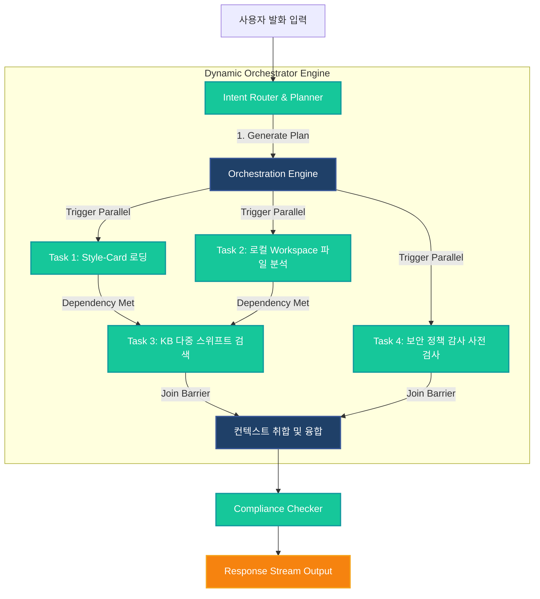

# Veluga Orchestration & State Management Design Specification

> Status: **Planning**  
> Author: GitHub Copilot (Gemini 3.5 Flash)  
> Date: 2026-05-26  
> Scope: **Enterprise-grade DAG Orchestrator & Centralized Agent State Management (FSM)**

---

## 1. 개요 (Executive Summary)

현재 Veluga의 7대 에이전트 시스템은 고정된 순차 파이프라인(Sequential Pipeline) 구조를 따르고 있으며, `PolicyContext`를 하나의 전역 매개변수처럼 다음 호출 단계로 넘기는 구조에만 의존하고 있습니다. 이로 인해 다중 KB 검색, 대용량 파일 분석, 도구 병렬 호출 및 자가 치유(Abort/Timeout) 라이프사이클을 매끄럽게 흡수하기가 불가능합니다.

이를 해결하기 위해, 본 사양은 **동적 DAG(Directed Acyclic Graph) 실행 엔진**과 **엄격한 규칙(Strict Transition)을 따르는 유한 상태 머신(FSM) 중앙 관리자**를 결합하는 차세대 Veluga 오케스트레이션 아키텍처를 정의합니다.

---

## 2. 해결하고자 하는 핵심 한계점

1. **지연 성능(High Latency) 문제**:
   * 서로 데이터상 의존성이 없는 다중 독립 도구 호출(`kb-mcp-adapter` 검색과 로컬 샌드박스의 빌드 체크 등)이 직렬로 수행됨으로써 불필요하게 대기 성능이 저하되는 한계.
2. **복합 상태 관리 결여**:
   * 태스크 중간 단계별로 부분 복구(Partial Recovery), 휴먼 인 더 루프(Human-in-the-Loop) 승인 요청 대기, 사용자의 강제 취소(Abort Signal) 등의 유동적 제어가 메인-렌더러 전역에서 추적 불가능함.
3. **엄격한 정책 검증과의 실시간 불일치**:
   * 병렬로 돌고 있는 도구 호출에 대하여 실시간 `PolicyGuard`가 개별 통제를 적용하고 거부(Deny) 이벤트를 발생시킬 때, 다른 실행 중인 태스크를 즉각 차단하고 롤백할 방법이 없음.

---

## 3. 동적 DAG 오케스트레이터 설계 (`VelugaOrchestrator`)

### 3.1 개념 모델

사용자 요청이 수신되면 `IntentRouter` 및 확장된 `GeneralPlanner`가 단일 절차식 플랜 대신 아래와 같이 **태스크의 상호 의존관계**를 파악한 그래프 구조(`DynamicAgentPlan`)를 구성합니다.



### 3.2 Canonical Types 스펙 (`packages/shared-types/src/intent.ts` 확장 예정)

```typescript
export type TagType = 'kb-reader' | 'file-analyzer' | 'sandbox-ops' | 'style-checker' | 'compliance-checker';

export interface AgentTask {
  id: string;               // UUID v4 태스크 고유 식별값
  agentType: TagType;       // 태스크를 전담할 시스템 에이전트 분류
  dependencies: string[];   // 해당 태스크가 실행 가능하기 위해 완료되어야만 하는 선행 Task ID 배열
  payload: {
    command?: string;
    targetFiles?: string[];
    kbScopes?: string[];
    [key: string]: any;     // 동적 실행 정보 매개변수
  };
  status: 'pending' | 'running' | 'completed' | 'failed' | 'aborted';
  result?: any;             // 실행 완료 데이터 결과물
  error?: string;           // 실패 원인 에러 메시지
  startedAt?: number;       // 고해상도 타임스탬프 (상태 로깅용)
  completedAt?: number;
}

export interface DynamicAgentPlan {
  sessionId: string;
  tasks: AgentTask[];
  dataPassingMode: 'memory' | 'project_temp';
  rationale: string;
}
```

### 3.3 대시 스케줄링 메커니즘 (`orchestrator.ts`)

```typescript
import type { DynamicAgentPlan, AgentTask } from '@veluga/shared-types';

export class VelugaOrchestrator {
  private activePromises = new Map<string, Promise<void>>();
  private abortController = new AbortController();

  constructor(
    private readonly maxConcurrency = 3,
    private readonly defaultTimeoutMs = 30000
  ) {}

  public async executePlan(
    plan: DynamicAgentPlan, 
    onTaskUpdate: (task: AgentTask) => void
  ): Promise<Record<string, any>> {
    const tasks = plan.tasks;
    const completedResults = new Map<string, any>();

    while (completedResults.size < tasks.length) {
      // 1. 실행 조건 충족 대상 검색
      const runnableTasks = tasks.filter(t => 
        t.status === 'pending' &&
        t.dependencies.every(depId => {
          const dep = tasks.find(x => x.id === depId);
          return dep && dep.status === 'completed';
        })
      );

      // 더 이상 무언가를 동시 실행할 공간이 가득 찼으면 대기 단계로 스킵
      for (const task of runnableTasks) {
        if (this.activePromises.size >= this.maxConcurrency) break;

        task.status = 'running';
        task.startedAt = Date.now();
        onTaskUpdate(task);

        // 비동기 작업에 타임아웃 래핑 처리 적용
        const taskPromise = this.executeWithTimeout(task)
          .then((res) => {
            task.status = 'completed';
            task.completedAt = Date.now();
            task.result = res;
            completedResults.set(task.id, res);
            this.activePromises.delete(task.id);
            onTaskUpdate(task);
          })
          .catch((err) => {
            task.status = 'failed';
            task.completedAt = Date.now();
            task.error = err.message || String(err);
            this.activePromises.delete(task.id);
            onTaskUpdate(task);
            this.propagateFailureCascade(task.id, tasks, onTaskUpdate);
          });

        this.activePromises.set(task.id, taskPromise);
      }

      // 교착 상태 체크 수립
      if (this.activePromises.size === 0 && completedResults.size < tasks.length) {
        const abortedCount = tasks.filter(t => t.status === 'aborted' || t.status === 'failed').length;
        throw new Error(`Orchestration Engine Abrupt Stop: Failed or Aborted Dependency Pipeline. Count: ${abortedCount}`);
      }

      // 하나라도 끝나는 시점까지 스케줄링 동기 지점 수립
      await Promise.race(this.activePromises.values());
    }

    return Object.fromEntries(completedResults);
  }

  private async executeWithTimeout(task: AgentTask): Promise<any> {
    const signal = this.abortController.signal;
    return new Promise((resolve, reject) => {
      const timer = setTimeout(() => {
        reject(new Error(`Task Timeout Limit Reached (${this.defaultTimeoutMs}ms)`));
      }, this.defaultTimeoutMs);

      if (signal.aborted) {
        clearTimeout(timer);
        return reject(new Error('Task execution aborted before startup'));
      }

      signal.addEventListener('abort', () => {
        clearTimeout(timer);
        reject(new Error('Task execution aborted midway'));
      });

      // 개별 전용 서브프로세스 또는 Sandbox 인스턴트 가동부 바인딩 부분
      this.runActualAgentWorker(task, signal)
        .then((res) => {
          clearTimeout(timer);
          resolve(res);
        })
        .catch((err) => {
          clearTimeout(timer);
          reject(err);
        });
    });
  }

  private async runActualAgentWorker(task: AgentTask, signal: AbortSignal): Promise<any> {
    // 세부 실행 구현 (예: KnowledgeGate, File Parser, Docker Ops 호출 브리지)
    return { data: `Dummy result for indeed tasks: ${task.agentType}` };
  }

  private propagateFailureCascade(failedTaskId: string, tasks: AgentTask[], onUpdate: (task: AgentTask) => void) {
    const targetChain = tasks.filter(t => t.dependencies.includes(failedTaskId));
    for (const child of targetChain) {
      if (child.status === 'pending') {
        child.status = 'aborted';
        child.error = `Parent Task ${failedTaskId} failed. Propagation Cascade Cancel.`;
        onUpdate(child);
        this.propagateFailureCascade(child.id, tasks, onUpdate);
      }
    }
  }

  public abortAll() {
    this.abortController.abort();
    this.activePromises.clear();
  }
}
```

---

## 4. 유한 상태 머신 (FSM) 기반 중앙 상태 매니저 (`AgentStateManager`)

다차원적인 상태 궤적과 비동기 사용자 요인(인증, 승인 지연) 등을 정해진 상태 및 전이 흐름에 묶어 제약받게 함으로써 오차 발생을 배제합니다.

### 4.1 상태 후보 정의 (`AgentState`)

* **IDLE**: 유저 발화 대기 상태
* **PLANNING**: 입력 메시지를 받아 `IntentRouter`에서 DAG 계획 수립 및 검증 중
* **AWAITING_CLARIFICATION**: Planner 분석 결과 모호한 개념이 발견되어 유저에게 명확화 질문 처리 지점
* **RUNNING_PARALLEL**: 병렬 태스크 실행 엔진 위에서 `AgentTask`들이 스케줄링 가동 중인 단계
* **AWAITING_APPROVAL**: `PolicyGuard` 통과 중 destructive 작업이 감지되어 `ApprovalQueue`에 들어가 승인 펜딩된 상황
* **COMPLIANCE_CHECKING**: 취합된 파편 답변 셋을 compliance-checker 가이드 포맷으로 원본 검증 중
* **STREAMING_RESPONSE**: 검증 완료 데이터를 실시간 세그먼트로 치역해서 렌더러에 스트리밍 중인 환경
* **CRITICAL_ERROR**: 복구 불가능한 인프라 에러가 발생한 탈출구

### 4.2 FSM 전이 매트릭스 (FSM Transition Rule Matrix)

| 출발 상태 (Current) | 전이 허가 목적 상태 (Allowed Next) |
|---|---|
| `IDLE` | `PLANNING`, `CRITICAL_ERROR` |
| `PLANNING` | `RUNNING_PARALLEL`, `AWAITING_CLARIFICATION`, `CRITICAL_ERROR` |
| `AWAITING_CLARIFICATION` | `PLANNING`, `IDLE`, `CRITICAL_ERROR` |
| `RUNNING_PARALLEL` | `AWAITING_APPROVAL`, `COMPLIANCE_CHECKING`, `CRITICAL_ERROR` |
| `AWAITING_APPROVAL` | `RUNNING_PARALLEL`, `IDLE`, `CRITICAL_ERROR` |
| `COMPLIANCE_CHECKING` | `STREAMING_RESPONSE`, `IDLE`, `CRITICAL_ERROR` |
| `STREAMING_RESPONSE` | `IDLE`, `CRITICAL_ERROR` |
| `CRITICAL_ERROR` | `IDLE` |

---

## 5. 실시간 동동 전파 & UI 결합 방식 (IPC Stream Synchronization)

프론트엔드 UI 컴포넌트(예: [packages/veluga-renderer/src/](../../packages/veluga-renderer/src/))와 백엔드 상태 관리자 싱크는 비동기 리액터 구조를 통해 완전 유실 없이 연동됩니다.

```
+--------------------------------------+                     +---------------------------------------+
|        Main Process (Node.js)        |                     |      Renderer Process (React UI)      |
|  [AgentStateManager] (FSM)           |                     |                                       |
|                  |                   |                     |  +---------------------------------+  |
|                  v (Transition)      |                     |  |  Zustand Global State Store     |  |
|         OnStateUpdateCB              |                     |  |  (agentStatus, runningTasks)    |  |
|                  |                   |                     |  +---------------------------------+  |
|                  v                   |                     |                  ^                    |
|      ipcMain.webContents.send()      | ======= IPC ======= |                  | (Apply Change)     |
|   ('veluga:agent-state-changed')     |                     |  ipcRenderer.on()                     |
|                                      |                     |  ('veluga:agent-state-changed')       |
+--------------------------------------+                     +---------------------------------------+
```

1. **상태 불변 객체 발행**: Main 프로세스의 상태 변화(`AgentCoreState`)는 Deep Copy 또는 불변 전이 방식으로 무조건 읽기전용 직렬화된 채로 렌더스 측에 발송합니다.
2. **실시간 태스크 그리드 컴포넌트 연관**: 렌더러는 수신 데이터를 받아 어떤 태스크가 현재 실행 상태(`running`, `completed`, `failed`) 영역에 들어가 병목이 일어나고 있는지 실시간 프로그레스 바 형태로 모니터링 컴포넌트에 뿌릴 수 있습니다.

---

## 6. 추가 핵심 가이드 설계 및 주의점

### 6.1 병렬 처리에서의 엄격한 정책 감시 적용 (`PolicyGuard` Integration)
* 태스크 다중 병렬 실행 시, 생성되는 각각의 하브 태스크 인스턴스는 부모의 `PolicyContext` 스냅샷을 상속받아 사용합니다.
* 특정 태스크 내부에서 `PolicyGuard.onBeforeCall` 제약조건(예: Secret clearance 미충족, 특정 리소스 접근 금지 등)이 걸리는 경우, 해당 개별 태스크는 즉각 실패 처리되며 오케스트레이터의 실패 Cascading 규칙에 따라서 다른 태스크들에게 지연 없이 즉각 `aborted` 신호가 전이됩니다.

### 6.2 자가 치유(Abort/Clean-up) 요구 사항
* 사용자가 채팅 전송 취소 버튼을 클릭할 시 백엔드로 IPC `cancel-agent-session` 신호가 직행해야 합니다.
* 오케스트레이터의 `abortAll()`이 연동 호출되며 실행 중인 `Promise`가 reject 됨과 동시에, 현재 임시 파일 쓰기를 구동하던 로컬 `fs` 파이프라인 정리 및 기동 중인 WSL/Lima/Docker 서브프로세스 `kill()` 체인이 안전하게 작동합니다.

### 6.3 감사 시스템 합류 (`better-sqlite3` Sequential Line)
* 동적으로 분기 일 가동되는 모든 Task들의 상태 천이는 `AuditLogger.append()`를 통해 로컬 SQLite DB에 실시간 적재됩니다.
```json
{
  "session_id": "session-v4-abc",
  "event_type": "orchestration.task_transition",
  "payload": {
    "task_id": "task-001",
    "agent_type": "kb-reader",
    "from_status": "pending",
    "to_status": "running",
    "trigger_reason": "Scheduler dependencies met"
  }
}
```

### 6.4 `VelugaModeToggle` 스위치 연동 완벽 보장
* 정책 context의 `policy.veluga.enable_veluga_orchestration` 값이 `false` 수준인 경우, 메인-미들웨어 실행 부위는 이 사양 문서에 기재된 FSM/DAG 가동 구문을 거치지 않고, Open Cowork 포크 오리지널 메커니즘을 순수 보장하여 구동하는 이중 파이프 바이패스를 견고히 유지합니다.
