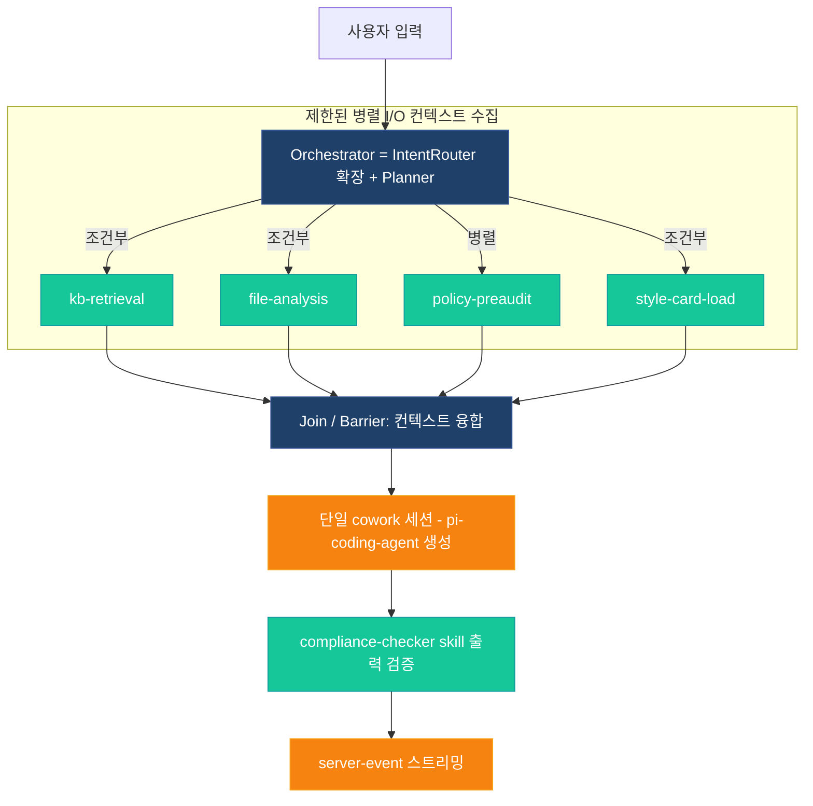

# 03 — 하드닝 아키텍처 (참조)

> 상위 인덱스: [README.md](README.md) · 이전: [02-gap-analysis.md](02-gap-analysis.md) · 다음: [10-phase1-orchestrator-worker.md](10-phase1-orchestrator-worker.md)

단계별 구현(10/11/12)이 공유하는 안정적 설계 기준. 근거는 [01-background-research.md](01-background-research.md), 교정 대상은 [02-gap-analysis.md](02-gap-analysis.md).

---

## 1. 토폴로지 (오케스트레이터-워커)



- 병렬 대상은 **독립 I/O 컨텍스트 수집으로 한정**(Anthropic sectioning). 생성은 단일 세션(Phase 1). 진짜 병렬 LLM 서브세션은 Phase 3의 bounded sub-session으로만.
- 분기는 **정적 그래프 + 조건부 엣지**(예: `use_kb=false`면 kb-retrieval skip).
- 워커는 서로 통신하지 않으며 모든 상태는 오케스트레이터 보유. 워커는 격리된 `ContextFragment`만 반환.

---

## 2. 통합 모델 (포크 제약 준수)

- Orchestrator는 **veluga-main**에 위치, [packages/veluga-main/src/ipc-middleware.ts](packages/veluga-main/src/ipc-middleware.ts)의 `handleUserMessage` fast-path 이후 진입. `enable_veluga_orchestration=false`면 즉시 `fallback` 바이패스.
- cowork 결합은 **오직** `AgentRuntimeExtension.beforeSessionRun()`(컨텍스트/프롬프트 prefix 주입·도구 추가) + `afterSessionRun()`(사후 audit/compliance) + `ToolDefinition.execute` 래퍼. **cowork-core 수정 금지.**
- 상태 전파: 기존 `server-event` 채널 + 타입드 이벤트.

---

## 3. 타입 (`packages/shared-types/src/intent.ts` 확장)

### 3.1 정의

```typescript
export type WorkerType = 'kb-retrieval' | 'file-analysis' | 'policy-preaudit' | 'style-card-load';

export interface ContextFragment {
  workerType: WorkerType;
  summary: string;                 // 오케스트레이터로 반환되는 압축 컨텍스트
  citations: CitationTag[];        // 기존 CitationTag 재사용
  tokensUsed: number;
}

export interface WorkerTask {
  id: string;
  workerType: WorkerType;
  dependencies: string[];
  // 서브에이전트 계약 (Anthropic 4요소)
  objective: string;
  outputContract: { shape: 'context_fragment'; schemaRef: string };
  toolScope: string[];             // 최소권한
  boundaries: string[];            // out-of-scope
  // 실행 메타
  payload: Readonly<Record<string, string | string[]>>;
  status: 'pending' | 'running' | 'completed' | 'failed' | 'aborted' | 'skipped';
  optional: boolean;               // true: 실패 시 degrade(=skipped)
  attempts: number;
  idempotencyKey: string;
  result?: ContextFragment;
  error?: string;
  startedAt?: number;
  completedAt?: number;
}

export interface WorkPlan {
  sessionId: string;
  tasks: WorkerTask[];
  dataPassingMode: 'memory' | 'project_temp';
  effortTier: 'single' | 'small' | 'broad';
  rationale: string;
}
```

### 3.2 워커 ↔ 기존 자원 매핑

| WorkerType | 재사용 자원 |
|---|---|
| `kb-retrieval` | [knowledge-gate.ts](packages/veluga-main/src/agents/knowledge-gate.ts) + kb-mcp-adapter |
| `file-analysis` | project/workspace 파일 파서 |
| `policy-preaudit` | [policy-guard.ts](packages/veluga-main/src/agents/policy-guard.ts) dry-run |
| `style-card-load` | style-card 자원 |

---

## 4. 엔진 (`orchestrator/orchestrator.ts`) — 핵심 불변식

> 전체 참조 구현 골격은 [10-phase1-orchestrator-worker.md](10-phase1-orchestrator-worker.md)에 수록.

1. **사전 검증**: 실행 전 Kahn 위상정렬로 사이클 검출 + 모든 `dependencies` ID 존재 검증 + `toolScope ⊆ 정책 화이트리스트`. 실패 시 PLANNING에서 거부.
2. **종료 조건**: 터미널 상태(`completed|failed|aborted|skipped`) 집합으로 판정.
3. **부분 실패**: `optional=true` 실패 → `skipped` degrade(cascade 안 함). 필수 실패만 의존 체인 cascade abort.
4. **재시도**: 일시 오류만 `delay=min(cap, base·2^(n-1))+jitter`로 N회. 비재시도 오류(정책 deny)는 즉시 실패.
5. **회로차단기**: 동일 워커/게이트웨이 연속 실패 시 일시 차단·점진 복구.
6. **멱등성**: 부작용 태스크는 `idempotencyKey`로 중복 방지(재시도/재개 시 캐시).
7. **AbortSignal**: 호출자(세션) 소유 signal 주입, `finally`에서 리스너 해제. 인스턴스 재사용 가능.
8. **동시성**: `maxConcurrency`는 I/O 바운드 게이트웨이 호출 한도(서브프로세스 병렬 아님).

---

## 5. 상태 관리 (`orchestrator/agent-state-manager.ts`)

### 5.1 세션 FSM (태스크 라이프사이클과 분리)

`IDLE · PLANNING · AWAITING_CLARIFICATION · RUNNING_PARALLEL · AWAITING_APPROVAL · COMPLIANCE_CHECKING · STREAMING_RESPONSE · CRITICAL_ERROR`

### 5.2 전이 매트릭스 (코드로 강제 — 불법 전이 throw + audit)

| 출발 | 허용 다음 |
|---|---|
| `IDLE` | `PLANNING`, `CRITICAL_ERROR` |
| `PLANNING` | `RUNNING_PARALLEL`, `AWAITING_CLARIFICATION`, `CRITICAL_ERROR` |
| `AWAITING_CLARIFICATION` | `PLANNING`, `IDLE`, `CRITICAL_ERROR` |
| `RUNNING_PARALLEL` | `AWAITING_APPROVAL`, `COMPLIANCE_CHECKING`, `PLANNING`, `CRITICAL_ERROR` |
| `AWAITING_APPROVAL` | `RUNNING_PARALLEL`, `IDLE`, `CRITICAL_ERROR` |
| `COMPLIANCE_CHECKING` | `STREAMING_RESPONSE`, `IDLE`, `CRITICAL_ERROR` |
| `STREAMING_RESPONSE` | `IDLE`, `CRITICAL_ERROR` |
| `CRITICAL_ERROR` | `IDLE` |

### 5.3 HITL payload 고정

`AWAITING_APPROVAL` 진입 시 승인 대상 도구 인자를 **해시로 고정**. 재개 시 해시 불일치면 실행 거부(approved-payload-drift 방지). 승인 경로는 [approval-queue.ts](packages/veluga-main/src/approval/approval-queue.ts) + cowork `SessionManager.requestPermission`/`permission.request`/`PermissionDialog` 재사용. [tool-interceptor.ts](packages/veluga-main/src/tool-interceptor.ts)가 현재 `require_approval`에서 throw하는 부분을 승인 큐 연동으로 교체.

---

## 6. 프로덕션 계층

### 6.1 체크포인트/재개 (`orchestrator/checkpoint-store.ts`, `node:sqlite`)

- `orchestration_checkpoint` 테이블에 WorkPlan/태스크 상태/터미널 결과를 단계마다 직렬화 저장.
- 크래시/재시작 시 미완 세션 재구성 → 멱등 태스크는 캐시 스킵, 부작용 없는 I/O 게이트는 재실행 안전, 재개 불가 태스크는 깔끔히 실패.
- audit(불변·해시체인)과 checkpoint(재개용 가변)는 책임 분리.

### 6.2 관측성/트레이싱

- [audit-logger.ts](packages/veluga-main/src/audit-logger.ts) 위 구조적 스팬: 세션 root → 태스크 child. OTel GenAI 속성(`gen_ai.usage.*`, `gen_ai.request.model`, `gen_ai.response.finish_reasons`, `workerType`, `attempts`, `latency_ms`, `from/to_status`). 상관 ID=`session_id`+`task_id`.
- SaaS 텔레메트리 SDK 금지. 연결망에서만 self-hosted OTLP collector(egress 허용목록) 옵션.

### 6.3 비용/스텝 예산

- 세션당 토큰 예산 + 최대 스텝/반복 한도(런어웨이 가드). 노력 스케일링(`effortTier`). 기존 `policy.veluga.kb_token_budget` 활용.

### 6.4 보안

- 도구 출력 = 신뢰 불가(indirect prompt injection): 워커 반환 컨텍스트는 원 의도 대비 검증 후 주입. 최소권한 `toolScope`. 인가는 LLM 외부([policy-guard.ts](packages/veluga-main/src/agents/policy-guard.ts)/[merge.ts](packages/policy-service/src/merge.ts)). 병렬 태스크는 부모 `PolicyContext` 읽기전용 스냅샷 상속.

### 6.5 취소·정리

- 채팅 취소 IPC → 세션 `AbortController.abort()` 전파. 실행 Promise reject + 임시파일 `fs.unlink` + WSL/Lima/Docker 서브프로세스 SIGTERM→(타임아웃)SIGKILL.

### 6.6 킬스위치 + 배포 프로파일

- `enable_veluga_orchestration=false` → 바닐라 Open Cowork 바이패스(이중 파이프). 레인보우 배포.
- **배포 프로파일 인식**: 게이트웨이 추상화가 망-모드를 추상화 → 연결망은 앱 코드 변경 없이 `VELUGA_LLM_GATEWAY_URL`만 클라우드 엔드포인트로. 프로파일은 정책에서 파생(`policy.effective.external_apis: allow|deny`; 필요 시 institution tier에 `deployment_profile` 추가, merge는 하위 tier 제한만). 폐쇄망=외부 커넥터/웹툴 비활성·화이트아웃 검증; 연결망=외부 KB/MCP·프롬프트 캐싱 가능하되 egress 허용목록·TLS·데이터 주권/PII 강제.

---

## 7. 플래너 + 검증 (`orchestrator/planner.ts`)

- WorkPlan 생성은 [intent-router.ts](packages/veluga-main/src/agents/intent-router.ts)의 `classify → sanitizePlan` 검증 패턴 재사용: LLM JSON → 엄격 스키마 sanitize(정책 화이트리스트 교집합, 미허용 스킬/스코프 제거) → 실패 시 휴리스틱 폴백.
- 플래너 프롬프트는 각 워커에 **4요소(목표/출력형식/도구가이드/범위경계)** + **effort-scaling 규칙** + 출력 JSON 스키마를 강제. 도구 설명은 무중복·명확화.

---

## 8. 신규/수정 파일 (요약)

**신규**: `packages/veluga-main/src/orchestrator/{orchestrator,agent-state-manager,checkpoint-store,planner}.ts`
**수정**: [shared-types/src/intent.ts](packages/shared-types/src/intent.ts), [ipc-middleware.ts](packages/veluga-main/src/ipc-middleware.ts), [tool-interceptor.ts](packages/veluga-main/src/tool-interceptor.ts), [audit-logger.ts](packages/veluga-main/src/audit-logger.ts)
**재사용**: intent-router(sanitizePlan), knowledge-gate, skill-resolver, policy-guard, approval-queue, llm-gateway, compliance-checker
