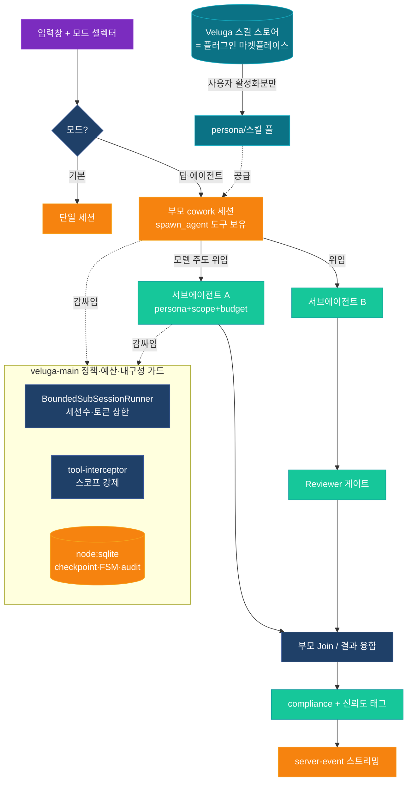

# 00 — 개요 (Overview)

> 상위 인덱스: [README.md](README.md)
> Status: **📝 계획 초안 (rev.2)** · 2026-06-03
> rev.2 변경: cowork-core 비수정 원칙 **해제** 반영 → 엔진을 **네이티브 서브에이전트 primitive(코어 선택 수정)** 로 재설계 · 하네스 수용을 **마켓플레이스/활성화 기반(직접 이식 아님)** 으로 변경 · "멀티에이전트 기본 가용"을 1순위 목표로 격상. (rev.1의 Hooks 전용안은 [§직전 방향 대비 변경](#직전-방향-대비-변경) 참조.)

---

## 목적

[harness](https://github.com/revfactory/harness) / [harness-100](https://github.com/revfactory/harness-100)은 **다중 LLM 전문가가 역할을 나눠 협업**하는 팀 구조를 전제로 하고, 그 협업은 Claude Code 네이티브 `TeamCreate`/`SendMessage`/`Agent`(subagent) 메커니즘에 의존한다. 그런데 조사 결과 Veluga가 쓰는 base SDK(`pi-coding-agent`)에는 **서브에이전트/팀/Task 위임 primitive가 존재하지 않는다**(`AgentSession`은 단일 세션 클래스, `sendMessage`는 확장→UI 메시지 전송용). 즉 harness의 팀 모델이 바인딩할 네이티브 토대가 비어 있다.

이 계획은 그 토대를 **만들어 넣는다**. 현재 결정에서 "Open Cowork 본체 비수정" 제약이 해제되었으므로, 멀티에이전트를 외부에서 흉내 내는 대신 **에이전트 런타임에 절제된 네이티브 서브에이전트 primitive를 직접 추가**하는 것이 더 효과적이라고 판단한다(근거 §엔진 결정). 그 위에서:

1. **멀티에이전트를 기본적으로 누구나 쓸 수 있게 한다** — 별도 설치/설정 없이도 모델이 필요 시 서브에이전트에 위임. 입력창의 **딥 에이전트 모드**가 접근 지점.
2. **harness 자산은 마켓플레이스로 수용한다** — 지금 직접 이식하지 않고, Cowork가 이미 가진 **플러그인 마켓플레이스 + 설치/활성화 인프라**에 올려 두고 **사용자가 활성화한 것만** 로드. 이번 단계는 "가져왔을 때"의 수용·활성화 구조(계약)를 설계한다.
3. **기존 오케스트레이션을 정책·예산·내구성 레이어로 재사용한다** — [`agent-orchestration`](../agent-orchestration/README.md)의 `VelugaOrchestrator`·체크포인트·FSM·감사를 서브에이전트 실행의 가드/회계 계층으로.

---

## 범위 (In / Out)

**In scope**

- **네이티브 서브에이전트 primitive**: [agent-runner.ts](../../../packages/cowork-core/src/main/claude/agent-runner.ts)에 모델이 호출하는 `spawn_agent`(Task형) 도구를 추가 — 자식 `PiAgentSession`을 {persona/system, 최소 tool 스코프, objective, 예산}으로 기동하고, 활동을 UI에 스트리밍하며, 구조화된 결과를 부모에 반환.
- **딥 에이전트 모드 + 기본 가용**: 입력창 모드 셀렉터(`기본 ↔ 딥 에이전트`). 모드 진입 시 위임 primitive가 기본 활성. 정책 허용 시 저마찰로 노출.
- **정책·예산·내구성 통합**: 서브에이전트 기동을 [`BoundedSubSessionRunner`](../../../packages/veluga-main/src/orchestrator/sub-session.ts)가 bounded 실행(세션 수·합산 토큰 상한), [tool-interceptor](../../../packages/veluga-main/src/tool-interceptor.ts)가 스코프 강제, [checkpoint-store](../../../packages/veluga-main/src/orchestrator/checkpoint-store.ts)·[agent-state-manager](../../../packages/veluga-main/src/orchestrator/agent-state-manager.ts)가 재개·FSM·감사.
- **하네스 마켓플레이스 수용 계약**: 기존 [`PluginRuntimeService`](../../../packages/cowork-core/src/main/skills/plugin-runtime-service.ts)/[`PluginCatalogService`](../../../packages/cowork-core/src/main/skills/plugin-catalog-service.ts)/`plugin-registry-store` 위에서, 플러그인 활성화 시 그 **스킬**은 [skills-manager](../../../packages/cowork-core/src/main/skills/skills-manager.ts)가 로드하고 **agents 컴포넌트**는 서브에이전트 persona/프로필로 등록되는 번역 계약. 가드레일 스크럽·정책 게이팅 포함.

**Out of scope (현 단계)**

- harness-100 **대량 직접 이식** — 본 단계는 마켓플레이스 수용·활성화 구조와 1~2개 검증 패키지까지만. 도메인 큐레이션·대량 등록은 후속.
- Claude Code 네이티브 `TeamCreate`/`SendMessage` 활성화 — 폐쇄망·게이트웨이와 충돌. 에이전트 간 직접 통신 대신 **부모 오케스트레이션 경유 위임/결과 반환**으로 대체.
- 완전 무제한 동적 위임(깊이/세션 수 상한 없는 재귀) · 외부 SaaS 트레이싱 SDK.
- `claude.com/plugins` 공개 카탈로그·`claude plugin install` CLI 셸아웃의 **그대로 사용**(화이트아웃·게이트웨이 위반 — Veluga 자체 카탈로그/설치 경로로 대체. §하네스 수용).

---

## 확정 결정 (사용자 승인)

| # | 항목 | rev.1 (2026-06-03 오전) | **rev.2 (반영)** | 근거 |
|---|---|---|---|---|
| 1 | 멀티에이전트 엔진 | Hooks 전용(코어 비수정) | **코어 선택 수정 — 네이티브 서브에이전트 primitive** | 비수정 원칙 해제 + base에 primitive 부재 → 직접 추가가 더 효과적·UX 우위 |
| 2 | 기반 구조 | 기존 orchestration 위 확장 | **유지** — 기존 위 확장 | 정책·예산·체크포인트·감사 재사용 |
| 3 | 하네스 수용 | 스킬 즉시 이식 + 번역 레이어 | **마켓플레이스/활성화 기반(직접 이식 아님)** | 사용자가 활성화한 것만 로드. Cowork 기존 플러그인 인프라 재사용 |
| 4 | 1순위 목표 | (모드 동작) | **멀티에이전트 기본 가용** | 설치 없이도 위임 가능, 저마찰 접근 |

---

## 불변식 vs 해제된 제약 (중요)

원칙 해제는 **cowork-core 소스 수정 금지**에 한한다. 나머지 보안·거버넌스 불변식은 **여전히 비협상**이며 서브에이전트/자식 세션에도 동일 적용된다.

| 구분 | 상태 | 의미 |
|---|---|---|
| Open Cowork 본체 비수정 | ❌ **해제** | 더 효과적이면 `agent-runner.ts` 등 직접 수정 가능(절제·문서화 전제) |
| LLM 게이트웨이 경유(`VELUGA_LLM_GATEWAY_URL`) | ✅ 불변 | 모든 자식 세션도 게이트웨이만. 공개 엔드포인트 하드코딩 금지(CI 강제) |
| 화이트아웃·텔레메트리 0 | ✅ 불변 | 마켓플레이스 카탈로그/설치도 외부 송신 0. 공개 카탈로그·CLI 셸아웃 대체 |
| 정책 우선(PolicyContext) | ✅ 불변 | persona가 권한을 넓힐 수 없음. 자식 tool 스코프 ⊆ 정책 화이트리스트 |
| 감사·신뢰도 태그·컴플라이언스 | ✅ 불변 | 자식 세션 도구 호출·산출도 audit·`compliance-checker`·태그 통과 |
| `node:sqlite` 영속·`server-event` IPC·킬스위치 | ✅ 불변 | 신규 플래그(예: `policy.veluga.deep_agent.enabled`) OFF 시 기존 동작 패리티 |

> 요컨대 **"코어는 고쳐도 되지만, 게이트웨이·화이트아웃·정책·감사 우회는 절대 불가."** 코어 수정의 목적은 우회가 아니라 *제대로 된 primitive를 정식 경로에 만드는 것*.

---

## 엔진 결정 — 왜 코어 직접 수정인가

`createAgentSession({ tools, customTools })`가 세션을 만들고, veluga의 `AgentRuntimeExtension`이 주입한 `customTools`·`promptPrefix`는 이미 모델 도구셋에 합쳐진다([agent-runner.ts L1971·L2109]). 따라서 *모델이 호출하는 위임 도구* 자체는 훅으로도 추가 가능하다. 그러나:

- **세션 구성 지식은 런너만 보유.** 게이트웨이 모델 선택·도구 래핑·타임아웃·UI 스트리밍(`sendMessage`)·감사 결선은 전부 `agent-runner` 내부 로직이다. 훅에서 자식 세션을 띄우려면 이 구성을 **재구현**하거나 런너 핸들을 우회로 끌어와야 한다 — 더 많은 코드, 더 약한 일관성.
- **UX·기본 가용 목표.** 중첩 에이전트의 진행을 네이티브로 렌더링(서브에이전트 패널/스트리밍)하려면 어차피 런너·렌더러를 건드린다. "기본적으로 쉽게" 쓰게 하려면 primitive가 1급이어야 한다.
- **harness 정합.** harness 패턴은 *모델 주도 위임*(supervisor/hierarchical)이 핵심. primitive를 런너에 두면 모델이 직접 위임을 결정할 수 있어 패턴이 자연스럽게 표현된다.

**결론**: `agent-runner.ts`에 **단일·잘 정의된 서브에이전트 primitive**(`spawn_agent`)를 추가하고, veluga-main 오케스트레이터가 이를 **정책·예산·내구성 가드로 감싼다.** 임의 다중 세션 난립이 아니라, 정식 경로 하나를 코어에 만들고 그 위에 통제를 얹는 절제된 수정이다.

---

## 하네스 수용 — 마켓플레이스/활성화 기반 (직접 이식 아님)

Cowork에는 이미 플러그인 마켓플레이스 인프라가 있고, harness/harness-100은 바로 그 **플러그인 포맷**(`.claude-plugin/plugin.json` + `agents/` + `skills/`)으로 배포된다. 플러그인 컴포넌트 카운트에 **agents·skills**가 포함된다.

| 단계 | 동작 | 재사용 자원 |
|---|---|---|
| 카탈로그 | Veluga **자체 호스팅 카탈로그**에서 팀 패키지 목록 제공 | `PluginCatalogService` (단, `claude.com/plugins` → Veluga 카탈로그로 대체, 화이트아웃) |
| 설치 | 사용자가 스토어에서 선택 → 설치(게이트 통과 후) | `PluginRuntimeService.install/installFromDirectory` (단, `claude plugin install` CLI 셸아웃 → Veluga 내부 설치 경로로 대체) |
| 활성화 | 사용자가 켠 것만 로드(컴포넌트 단위 가능) | `setEnabled`/`setComponentEnabled` + 정책 `active_skill_ids`/`hasSkill` 게이팅 |
| 스킬 수용 | 활성화된 플러그인의 `SKILL.md` 자동 감지 | `skills-manager` chokidar |
| 에이전트 수용 | 활성화된 플러그인의 `agents/*.md` → **서브에이전트 persona/프로필 등록**(번역 계약) | Deep Agent persona 레지스트리(신규) |
| 가드레일 | 설치 시 외부 SaaS 트레이서·직접 Anthropic 호출·원격 전송 **스크럽** | 설치 파이프라인 검사기(신규) |

> 핵심: **이번 단계엔 대량 이식 없음.** 마켓플레이스 수용·활성화·번역 "계약"과 검증용 1~2개 패키지만. 사용자가 나중에 스토어에서 원하는 팀만 켜면 그 스킬+에이전트가 딥 에이전트 모드에 합류한다.

---

## 6개 팀 패턴 → Veluga 실행 매핑

primitive가 모델 주도 위임을 지원하므로 6패턴 대부분이 자연 표현된다. 단, 전 패턴은 bounded(깊이·세션 수·토큰)·정책 스코프 안에서만.

| harness 패턴 | Veluga 실행 형태 | 비고 |
|---|---|---|
| Pipeline | 순차 `spawn_agent` 체인 또는 WorkPlan 선형 의존 | |
| Fan-out/Fan-in | bounded 병렬 `spawn_agent` + 부모 Join | `maxSubSessions`·합산 토큰 가드 |
| Expert Pool | 모델/조건부 엣지가 전문가 persona 선택 | 마켓 활성 persona 풀에서 |
| Producer-Reviewer | 생성 서브에이전트 → 검토 서브에이전트 게이트 | `compliance-checker` 결합 |
| Supervisor | 부모(모델 주도) 위임 + 오케스트레이터 재계획 가드 | 동적성은 `maxReplans` 상한 |
| Hierarchical Delegation | bounded 깊이의 중첩 `spawn_agent` | 깊이/세션 수 강제 상한 |

> 공통: **에이전트 간 직접 메시징 없음.** 위임·결과 반환은 부모 세션과 오케스트레이터를 통해서만 — 폐쇄망·감사·예산 통제와 정합.

---

## 아키텍처 토폴로지 (개념)

- 자식 세션 LLM 호출도 전부 게이트웨이·래핑된 도구·감사를 거친다(불변식). primitive는 우회로가 아니다.

---

## 모드 UX & 기본 가용

- 입력창(Composer) 인접 모드 셀렉터: `기본` · `딥 에이전트`. 패턴은 [`VelugaModeToggle`](../../../packages/veluga-renderer/src/VelugaModeToggle.tsx)·[`model-and-thinking-ui`](../model-and-thinking-ui.md) 헤더 스위처·[ask-user-question Composer 삽입 지점](../ask-user-question/60-step6-renderer-panel.md) 참고.
- **기본 가용**: 딥 에이전트 모드에선 위임 primitive가 기본 활성 — 마켓 패키지 설치 없이도 모델이 일반 서브에이전트로 위임 가능. 마켓 팀은 *선택적 강화*.
- 정책 `deep_agent.enabled=false`면 셀렉터 미노출(회귀 안전). 선택값은 `server-event`로 main 전달.
- 중첩 서브에이전트 활동은 UI에 네이티브 스트리밍(렌더러 추가). i18n ko/en 라벨 추가.

---

## 단계 로드맵 (개요 — 상세는 후속 문서 참조)

| Phase | 목표 | 상세 문서 | 핵심 산출물 |
|---|---|---|---|
| **1 — 네이티브 primitive + 기본 가용** | `spawn_agent` 코어 추가, 모드 셀렉터, 자식 세션 UI 스트리밍, veluga 가드 결선 | [10-phase1-native-primitive.md](10-phase1-native-primitive.md) | agent-runner 수정(절제), BoundedSubSessionRunner 라이브 결선, shared-types persona/스코프 확장, 렌더러 서브에이전트 패널 |
| **2 — 마켓플레이스 수용** | Veluga 자체 카탈로그·설치 경로, 활성화 게이팅, agents→persona 번역 계약, 가드레일 스크럽 | [11-phase2-marketplace-intake.md](11-phase2-marketplace-intake.md) | 카탈로그/설치 대체(화이트아웃), persona 레지스트리, 스크럽 검사기, 검증 패키지 1~2종 |
| **3 — 검토 패턴·동적성** | Producer-Reviewer/Supervisor 게이트, 효과 입증 시 동적 위임 확장 | [12-phase3-review-patterns.md](12-phase3-review-patterns.md) | 검토 게이트, 재계획 가드, A/B 효과 측정 |
| **검증** | 모드 OFF 패리티·E2E·관측성·예산/깊이 가드·게이트웨이/화이트아웃 회귀 | [20-verification.md](20-verification.md) | 테스트 매트릭스, CI 가드 |

> 타입 메모: 현행 [`BoundedSubSessionRequest`](../../../packages/shared-types/src/intent.ts)는 `{id, objective, boundaries, tokenBudget}`뿐. `persona/systemPrefix`·`toolScope`·`parentSessionId`·`depth`·`outputContract` 추가가 Phase 1 선결(shared-types는 Veluga 소유).

---

## 성공 기준

- 입력창에서 `딥 에이전트` 선택 시 **설치 없이도** 모델이 서브에이전트에 위임해 복잡 과제 품질이 개선(E2E·A/B)되고, 자식 세션이 정책 스코프를 한 번도 벗어나지 않는다.
- 자식 세션 포함 모든 LLM 호출이 게이트웨이 경유, 외부 송신/텔레메트리 0(화이트아웃 유지).
- 사용자가 스토어에서 **활성화한 팀 패키지만** 로드되고, 비활성/미설치는 무영향. 설치 시 가드레일 스크럽으로 외부 호출·트레이서 0건.
- 세션×서브에이전트 합산 토큰·세션 수·위임 깊이가 상한을 초과하지 않고, 모든 전이·사용량이 감사·체크포인트에 기록(해시체인 무결).
- 크래시 재시작 시 미완 서브에이전트만 재개/정리(멱등).
- **딥에이전트 OFF 시 기존 단일-세션 동작과 완전 패리티**(회귀 0).

---

## 미해결 및 후속 결정

> 미확정 결정을 임의로 구현하지 않는 원칙에 따라 아래는 `01~03`에서 확정.

1. **`spawn_agent` 노출 범위**: 항상 노출 vs 딥 에이전트 모드에서만 vs 정책 화이트리스트 도구로.
2. **위임 깊이·세션 수·토큰 상한 기본값**: 폐쇄망/연결망 프로파일별.
3. **모드 적용 단위**: 세션 고정 vs 메시지별 토글, 그리고 정책 허용 시 default-ON 여부.
4. **Veluga 카탈로그 호스팅 형태**: 사내 레지스트리/패키지 저장소 위치, 서명·검증, 폐쇄망 오프라인 번들.
5. **agents→persona 번역 시점**: 설치 시 변환·캐시 vs 활성화/로딩 시 변환.
6. **검토 게이트 강도 + HITL 결합**: Reviewer 반려 자동 재시도 횟수, 승인 큐 결합 지점.
7. **base 머지 전략**: 코어 수정분을 패치/포크 레이어로 격리해 clone snapshot 갱신 시 충돌 최소화하는 방법.

---

## 직전 방향 대비 변경

- **rev.1 → rev.2 (엔진 반전)**: rev.1은 "cowork-core 비수정"을 전제로 Hooks 전용 멀티세션을 권고했다. 사용자 통지로 **비수정 원칙이 이미 해제**되었고, 조사 결과 base에 서브에이전트 primitive가 **부재**함이 확인되어, Hooks 전용 흉내는 오히려 코드량↑·UX↓다. 따라서 **코어에 절제된 네이티브 primitive를 추가**하는 방향으로 반전한다.
- **이전 조사 메모와의 관계**: 최초 조사 메모가 제시한 "코어 직접 수정(네이티브 프로필/멀티세션)" 직관은 이번 결정으로 **부분 채택**된다. 단, 임의 다중 세션·우회가 아니라 **단일 primitive + veluga 가드 + 불변식(게이트웨이/화이트아웃/정책/감사) 유지**라는 절제된 형태로 한정한다.
- **하네스 수용 반전**: "지금 직접 이식"에서 **"마켓플레이스에 올리고 사용자가 활성화한 것만"** 으로 변경. Cowork 기존 플러그인 인프라를 재사용하고, 이번 단계는 수용·활성화 "구조"와 검증 패키지까지만.
